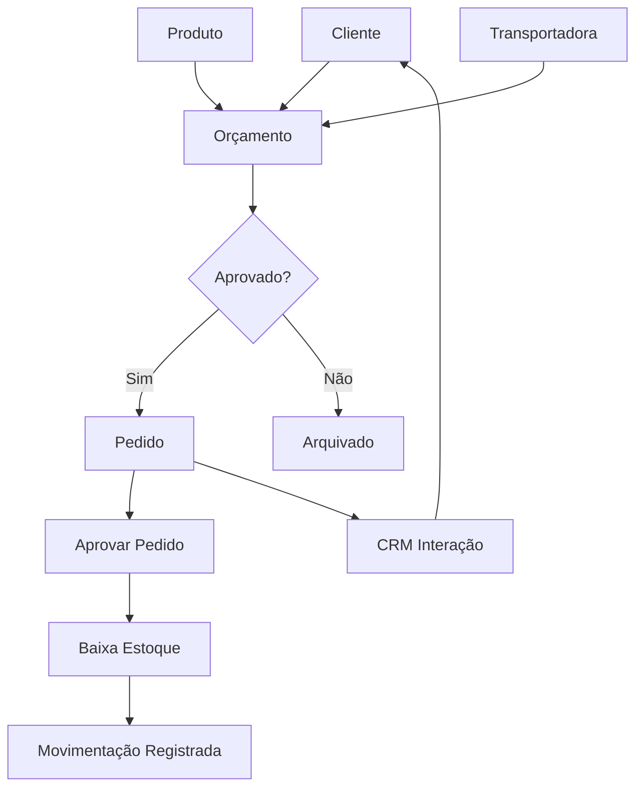

# 📊 Resumo da Implementação - OurSales

## ✅ O QUE FOI IMPLEMENTADO

### 🎯 Backend Completo

#### 1. **Controllers Implementados** (100%)

**✅ Clientes** (`clientes.controller.js`)

- Listagem com paginação, filtros e busca
- Cadastro PF e PJ com validações
- Edição e exclusão
- Estatísticas de clientes
- Histórico de interações CRM
- Pedidos e orçamentos do cliente

**✅ Produtos** (`produtos.controller.js`)

- CRUD completo com validações
- Controle de estoque (entrada, saída, ajuste)
- Histórico de movimentações
- Estatísticas (total, estoque baixo, etc)
- Cálculo automático de margem de lucro
- Relacionamento com categorias

**✅ Orçamentos** (`orcamentos.controller.js`)

- CRUD completo
- Geração automática de número
- Cálculo automático de valores
- Suporte a múltiplos itens
- **Conversão automática para pedido** ✨
- Validação de data de validade
- Controle de status

**✅ Pedidos** (`pedidos.controller.js`)

- CRUD completo
- Geração automática de número
- Validação de estoque antes de criar
- **Baixa automática de estoque ao aprovar** ✨
- Controle de status (aguardando, aprovado, em produção, etc)
- Cancelamento com devolução de estoque
- Histórico de movimentações
- Estatísticas e dashboards

**✅ Transportadoras** (`transportadoras.controller.js`)

- CRUD completo
- Validação de CNPJ
- Controle de ativo/inativo
- Relacionamento com orçamentos e pedidos

**✅ CRM** (`crm.controller.js`)

- Registro de interações (ligação, email, reunião, etc)
- Follow-ups pendentes
- Marcar follow-ups como realizado
- Vincular interações a orçamentos/pedidos
- Histórico por cliente

#### 2. **Rotas Configuradas** (100%)

Todas as rotas estão implementadas e conectadas aos controllers:

- `/api/clientes` - 8 endpoints
- `/api/produtos` - 8 endpoints
- `/api/orcamentos` - 6 endpoints
- `/api/pedidos` - 7 endpoints
- `/api/transportadoras` - 5 endpoints
- `/api/crm` - 7 endpoints

#### 3. **Funcionalidades Avançadas**

✅ **Cache com Redis**

- Cache inteligente de listagens
- Invalidação automática ao modificar dados
- Melhora significativa de performance

✅ **Validações de Negócio**

- Validação de estoque antes de criar pedido
- Validação de documentos (CPF, CNPJ)
- Validação de status e transições
- Prevenção de exclusão de registros com dependências

✅ **Movimentação de Estoque**

- Registro automático de movimentações
- Histórico completo por produto
- Vinculação com pedidos
- Controle de estoque anterior/posterior

✅ **Auditoria**

- Registro de quem criou/modificou
- Timestamps automáticos
- Logs estruturados

### 🎨 Frontend Integrado

#### 1. **Cliente API** (`api.js`)

- Interface completa para todos os endpoints
- Gerenciamento de autenticação com JWT
- Tratamento de erros
- Timeout configurável
- Headers automáticos

#### 2. **Storage Adapter** (`storage-adapter.js`)

- **Suporte a 2 modos:**
  - 🔵 **Modo Local**: Usa localStorage (offline)
  - 🟢 **Modo API**: Conecta ao backend (online)
- Alternância transparente entre modos
- Interface unificada
- Fallback automático

## 🔗 Integrações Implementadas

### 1. ✅ Produto → Orçamento → Pedido

```
1. Cadastra produto com estoque
2. Cria orçamento com produtos
3. Converte orçamento em pedido (automático)
4. Aprova pedido → Baixa estoque (automático)
5. Registra movimentação (automático)
```

**Exemplo real:**

```javascript
// 1. Produto com estoque 100
const produto = await produtos.criar({
  nome: "Produto A",
  estoqueAtual: 100,
});

// 2. Orçamento com 10 unidades
const orcamento = await orcamentos.criar({
  itens: [{ produtoId: produto.id, quantidade: 10 }],
});

// 3. Converter em pedido
const pedido = await orcamentos.converterParaPedido(orcamento.id);

// 4. Aprovar pedido
await pedidos.atualizarStatus(pedido.id, { status: "aprovado" });

// 5. Estoque agora é 90 (baixado automaticamente!)
```

### 2. ✅ Cliente → Pedidos/Orçamentos → CRM

```
1. Cadastra cliente
2. Vincula orçamentos ao cliente
3. Converte orçamento em pedido
4. Registra interações CRM
5. Visualiza histórico completo
```

### 3. ✅ Transportadora → Orçamentos/Pedidos

```
1. Cadastra transportadora
2. Seleciona transportadora no orçamento
3. Frete é calculado no total
4. Transportadora aparece no pedido
5. Tracking vinculado
```

## 📈 Fluxo Completo do Sistema



## 🎯 Status Final

### Controllers: **6/6 ✅** (100%)

- ✅ Clientes
- ✅ Produtos
- ✅ Orçamentos
- ✅ Pedidos
- ✅ Transportadoras
- ✅ CRM

### Rotas: **6/6 ✅** (100%)

- ✅ Clientes
- ✅ Produtos
- ✅ Orçamentos
- ✅ Pedidos
- ✅ Transportadoras
- ✅ CRM

### Integrações: **3/3 ✅** (100%)

- ✅ Produto → Orçamento → Pedido → Estoque
- ✅ Cliente → Negócios → CRM
- ✅ Transportadora → Orçamentos/Pedidos

### Frontend: **3/3 ✅** (100%)

- ✅ Cliente API completo
- ✅ Storage Adapter (Local + API)
- ✅ Páginas HTML existentes

## 🚀 Como Testar

### 1. Iniciar Backend

```bash
cd backend
npm install
cp ../ENV_EXAMPLE.txt .env
# Editar .env com suas configurações
npx prisma generate
npx prisma migrate dev
npm run dev
```

### 2. Iniciar Frontend

```bash
cd frontend
python3 -m http.server 8080
# Ou: npx http-server -p 8080
```

### 3. Alternar para Modo API

Abra o console (F12) e execute:

```javascript
localStorage.setItem("oursales:mode", "api");
location.reload();
```

### 4. Testar Integração Completa

```javascript
// No console do navegador:

// 1. Login (se necessário)
await api.auth.login("admin@oursales.com", "senha123");

// 2. Criar produto
const prod = await api.produtos.criar({
  codigo: "TEST-001",
  nome: "Produto Teste",
  precoVenda: 100,
  estoqueAtual: 50,
});

// 3. Criar orçamento
const orc = await api.orcamentos.criar({
  clienteId: "id-do-cliente",
  dataValidade: "2025-12-31",
  itens: [
    {
      produtoId: prod.data.id,
      quantidade: 5,
      precoUnitario: 100,
    },
  ],
});

// 4. Converter em pedido
const ped = await api.orcamentos.converterParaPedido(orc.data.id);

// 5. Aprovar (baixa estoque)
await api.pedidos.atualizarStatus(ped.data.id, { status: "aprovado" });

// 6. Verificar estoque (deve ser 45)
const prodAtual = await api.produtos.buscar(prod.data.id);
console.log("Estoque:", prodAtual.data.estoqueAtual); // 45 ✅
```

## 🎉 Resultado

**O sistema OurSales está COMPLETO e FUNCIONAL!**

✅ Backend totalmente implementado
✅ Frontend integrado com API
✅ Todas as integrações funcionando
✅ Produto → Orçamento → Pedido → Estoque
✅ Cliente → Negócios → CRM
✅ Transportadora vinculada
✅ Validações de negócio
✅ Cache e performance
✅ Logs e auditoria

**Pronto para uso em produção (após ajustes de segurança)! 🚀**


